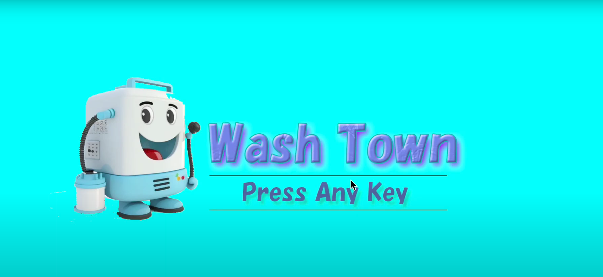

# WashTown

# description 
* タイトル:Wash Town
* ジャンル:洗浄アクション
* ターゲットプラットフォーム:PC
* 制作期間 2022/12/20〜2022/1/31
* [Proposal Document](./demoImage/WashTown_ProposalDocument.pdf)

# Demo
**Pleaze click image, then video will start.**

# Rule
* このゲームは高圧洗浄機を使って、汚れた物を洗うゲームです。 
* 制限時間内に洗うことができなければ依頼失敗です。 
* 依頼を達成するとお金がもらえます。 
* お金を使って道具を購入でき、依頼を効率よく達成することができます。 
* 依頼を達成していくと、店のランクが上がり店が豪華になっていきます。 

# Features
* アイテムの購入画面のデモ 
 
* 高圧洗浄機を使った洗浄画面のデモ 
 

# Requirement
* Unity 2021.3.11f1

# Note
this repository rid font assets off because the size is too large.
so you need to download font assets corresponding to Japanese.

# Author
* 一ノ宮綾平
* 九州デザイナー学院ゲームCG学科ゲームプログラミング専攻
