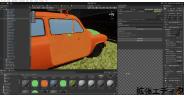
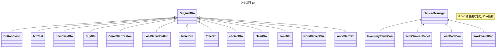
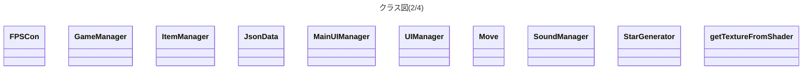
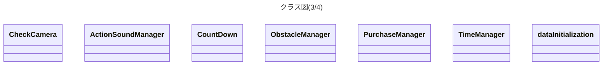
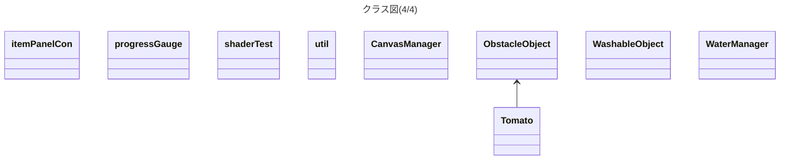

# WashTown

# description 
* タイトル:Wash Town
* ジャンル:洗浄アクション
* ターゲットプラットフォーム:PC
* 制作期間 2022/12/20〜2022/1/31
* [Proposal Document](./demoImage/WashTown_ProposalDocument.pdf)


# Demo
**Pleaze click image, then video will start.**
[](https://www.youtube.com/watch?v=d9GrC7sAbiU)

# Rule
* このゲームは高圧洗浄機を使って、汚れた物を洗うゲームです。<br>
* 制限時間内に洗うことができなければ依頼失敗です。<br>
* 依頼を達成するとお金がもらえます。<br>
* お金を使って道具を購入でき、依頼を効率よく達成することができます。<br>
* 依頼を達成していくと、店のランクが上がり店が豪華になっていきます。<br>

# Features
* リストからアイテムを選択し、購入することができます。<br>
<br>
* 高圧洗浄機を使って、汚れた物をキレイにしていく快感が得られます。<br>
<br>
・壁の汚れや、それを落とす処理は、シェーダーを書いて実現しています。
*モデルに汚れをつけるために、オリジナルの拡張エディタを使用しています。<br>
<br>

<details>
<summary>シェーダーコード(抜粋)</summary>

```
Shader "Custom/dirtyTexture"
{
    Properties{
       _MainTex("MainTex", 2D) = "white"
       [HideInInspector]
       _Blush("Blush", 2D) = "white"
       [HideInInspector]
       _BlushScale("BlushScale", FLOAT) = 0.1
       [HideInInspector]
       _BlushColor("BlushColor", VECTOR) = (0,0,0,1)
       [HideInInspector]
       _PaintUV("Hit UV Position", VECTOR) = (0,0,0,0)
    }
        SubShader{
            CGINCLUDE
                struct app_data {
                    float4 vertex:POSITION;
                    float4 uv:TEXCOORD0;
                };
                struct v2f {
                    float4 screen:SV_POSITION;
                    float4 uv:TEXCOORD0;
                };
                sampler2D _MainTex;
                sampler2D _Blush;
                float4 _PaintUV;
                float _BlushScale;
                float4 _BlushColor;
            ENDCG

            Pass{
                CGPROGRAM
    #pragma vertex vert
    #pragma fragment frag
                v2f vert(app_data i) {
                    v2f o;
                    o.screen = UnityObjectToClipPos(i.vertex);
                    o.uv = i.uv;
                    return o;
                }
                float4 frag(v2f i) : SV_TARGET {
                    float h = _BlushScale;
                    if (_PaintUV.x - h < i.uv.x && i.uv.x < _PaintUV.x + h &&
                            _PaintUV.y - h < i.uv.y && i.uv.y < _PaintUV.y + h) {
                        float4 col = tex2D(_Blush, (_PaintUV.xy - i.uv) / h * 0.5 + 0.5);
                        if (col.a!= 0)
                            return _BlushColor;
                    }
                    return tex2D(_MainTex, i.uv);
                }
                ENDCG
            }
       }
}
```

</details>

# Class Diagram (now on Creating)

   






    
# Requirement
* Unity 2021.3.11f1

# Note
this repository rid font assets off because the size is too large.
so you need to download font assets corresponding to Japanese.

# Author
* 一ノ宮綾平
* 九州デザイナー学院ゲームCG学科ゲームプログラミング専攻
